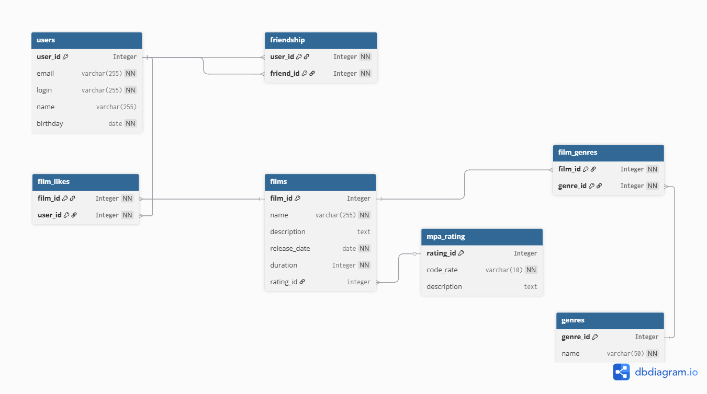

# java-filmorate
Template repository for Filmorate project.


# **Схема базы данных:** 

[](https://dbdiagram.io/d/68d95851d2b621e42242ff73)

Спроектированная база данных соответствует третьей нормальной форме (3NF) и поддерживает все бизнес-процессы приложения Filmorate.

## **Основные таблицы:**

**users** – хранение данных пользователей: идентификатор, email, логин, имя и дата рождения.

**films** – хранение данных о фильмах: идентификатор, название, описание, дата выпуска, продолжительность и рейтинг MPA.

**mpa_rating** – справочник рейтингов MPA (G, PG, PG-13, R, NC-17) с кратким кодом и текстовым описанием.

**genres** – справочник жанров фильмов (Комедия, Драма, Мультфильм и др.).

**Таблицы связей:**

friendship – дружеские связи между пользователями. Каждая пара (user_id, friend_id) уникальна. Симметрия дружбы реализуется в логике приложения (UserService).

film_genres – связь многих-ко-многим между фильмами и жанрами. Один фильм может принадлежать нескольким жанрам, один жанр – многим фильмам.

film_likes – лайки пользователей фильмам. Один пользователь может лайкнуть фильм только один раз.

______________________________

# **Примеры SQL-запросов:**
## **Для пользователя:**

Общие друзья двух пользователей:

```sql

SELECT u.* 
FROM users u
JOIN friendship f1 ON u.user_id = f1.friend_id AND f1.user_id = 1
JOIN friendship f2 ON u.user_id = f2.friend_id AND f2.user_id = 2;
```


Создание пользователя:

```sql
INSERT INTO users (email, login, name, birthday) 
VALUES ('user@example.com', 'userlogin', 'User Name', '1990-01-01');
```

_____________________________________________________

## **Для фильмов:**


Добавление фильма по жанру:

```sql
INSERT INTO film_genres (film_id, genre_id) 
VALUES (1, 1), (1, 2);
```

Получение 10 популярных фильмов:

```sql
SELECT f.*, COUNT(fl.user_id) AS likes_count
FROM films f
LEFT JOIN film_likes fl ON f.film_id = fl.film_id
GROUP BY f.film_id
ORDER BY likes_count DESC
LIMIT 10;
```

